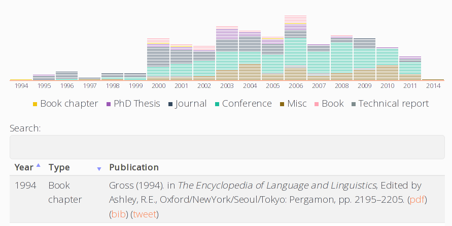
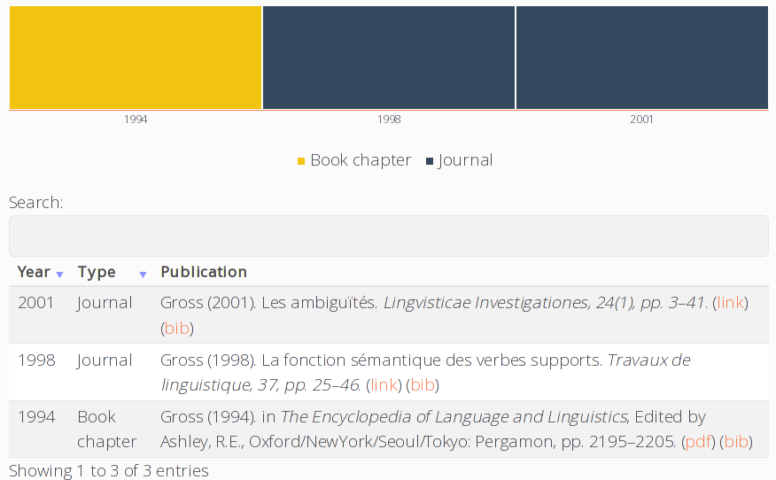

# Grav BibTeXify Plugin



## About

The **BibTeXify** plugin for Grav makes it trivial to create interactive publications lists with JavaScript and BibTeX using [bib-publication-list](https://github.com/vkaravir/bib-publication-list). 

## Installation

Typically a plugin should be installed via [GPM](http://learn.getgrav.org/advanced/grav-gpm) (Grav Package Manager):

```
$ bin/gpm install bibtexify
```

Alternatively it can be installed via the [Admin Plugin](http://learn.getgrav.org/admin-panel/plugins)

### Manual Installation

To install this plugin, just download the zip version of this repository and unzip it under `/your/site/grav/user/plugins`. Then, rename the folder to `bibtexify`. You can find these files on [GitHub](https://github.com/martinec/grav-plugin-bibtexify) or via [GetGrav.org](http://getgrav.org/downloads/plugins#extras).

You should now have all the plugin files under

    /your/site/grav/user/plugins/bibtexify
	
> NOTE: This plugin is a modular component for Grav which requires [Grav Shortcode Core Plugin](https://github.com/getgrav/grav-plugin-shortcode-core) to operate.

## Configuration Defaults

As this plugin requires the **Shortcode Core** functionality there are some configuration options there that will effect this one. For example setting the default `active` state to `false` will also cause this plugin to not function.

## Usage

This plugin provides the `[bibtexify]` shortcode. This is an example that shows off how you can easily turn a list of BibTeX references into a interactive page:

```
[bibtexify hideMissing=true]
@InBook{Gross1994,
  pages     = {2195--2205},
  title     = {The Encyclopedia of Language and Linguistics},
  publisher = {Oxford/NewYork/Seoul/Tokyo: Pergamon},
  year      = {1994},
  author    = {Gross, Maurice},
  editor    = {Ashley, R.E.},
  url       = {http://kybele.psych.cornell.edu/~edelman/TAU-05/Gross-french-lexicon-94.pdf},
}

@Article{Gross1998,
  author  = {Gross, Maurice},
  title   = {La fonction sémantique des verbes supports},
  journal = {Travaux de linguistique},
  year    = {1998},
  volume  = {37},
  pages   = {25--46},
  url     = {http://cat.inist.fr/?aModele=afficheN&cpsidt=2019110},
}

@Article{Gross2001b,
  author    = {Gross, Maurice},
  title     = {Les ambiguïtés},
  journal   = {Lingvisticae Investigationes},
  year      = {2001},
  volume    = {24},
  number    = {1},
  pages     = {3--41},
  publisher = {Amsterdam/Philadelphia : Benjamins},
  url       = {http://cat.inist.fr/?aModele=afficheN&cpsidt=13543081},
}
[/bibtexify]
```

This will be converted into the following:



## BibTeXify Options

The `[bibtexify]` shortcode accepts the options available for [bib-publication-list](https://github.com/vkaravir/bib-publication-list).
Options can be passed as attributes of the shortcode, a summary of the current ones appears below:

<table>
<tbody>
<tr><td>visualization</td><td>A boolean to control addition of the visualization. Defaults to true.</td></tr>
<tr><td>tweet</td><td>Twitter username to add Tweet links to bib items with a url field.</td></tr>
<tr><td>sorting</td><td>Control the default sorting of the list. Defaults to `[[0, "desc"], [1, "desc"]]`. See (https://legacy.datatables.net/api#fnSort) for details on formatting.</td></tr>
<tr><td>datatable</td><td>Pass options to the datatable library used to create the table of publications. See (https://legacy.datatables.net/api) for available options.</td></tr>
<tr><td>defaultYear</td><td>Entries without a year will use this as year. Defaults to "To Appear".
</tbody>
</table>

# Known issues

- [bib-publication-list](https://github.com/vkaravir/bib-publication-list) have some issues dealing with escaped characters. A possible workaround is to use [JabRef](http://www.jabref.org) to convert the LaTeX encodings to Unicode characters as follows: `Menu Edit > Select All` then `Menu Quality > Cleanup entries`, finally add a new formatter for `all-text-fields` with the operation `Latex to Unicode` and click OK.

# Credits

This plugin use a minimal modified version of  [bib-publication-list](https://github.com/vkaravir/bib-publication-list). The bib-publication-list author is [vkaravir](https://github.com/vkaravir).
